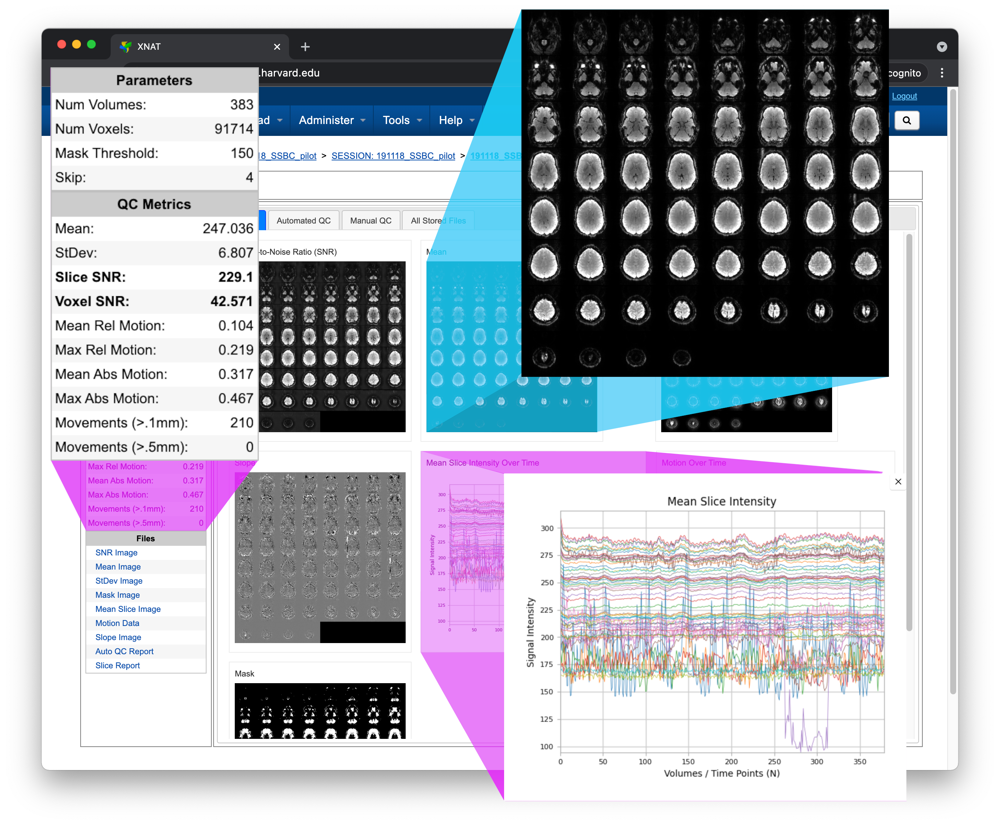

# Welcome to BOLDQC!

BOLDQC is a functional MRI quality control pipeline built upon industry standard
software packages including [FSL][] and [dcm2niix][]. Working closely with local 
neuroimaging experts, we developed a comprehensive quality control pipeline and 
user interface for the [XNAT][] informatics and data management platform. BOLDQC 
allows neuroimaging researchers to quickly assess image quality, and use those 
insights to respond to data acquisition errors.

Please refer to the main menu for detailed documentation!

[FSL]: https://fsl.fmrib.ox.ac.uk/fsl/docs/
[dcm2niix]: https://github.com/rordenlab/dcm2niix
[XNAT]: https://www.xnat.org
