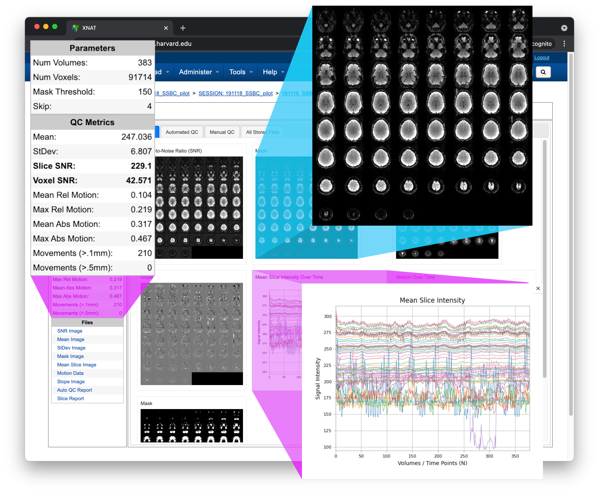

Welcome to BOLDQC's documentation!
==================================
.. _XNAT: https://doi.org/10.1385/NI:5:1:11
.. _BOLD: https://tinyurl.com/dxs6zj2z

BOLDQC is a fMRI quality control pipeline. Working closely with neuroimaging experts, we designed a simple ergonomic user interface for the `XNAT`_ informatics and data management platform that allows users to quickly assess image quality and use those insights to address issues within the data acquisition workflow.

.. toctree::
   :maxdepth: 2
   :caption: Contents:
   
   xnat
   developers

Indices and tables
==================

* :ref:`genindex`
* :ref:`modindex`
* :ref:`search`
