# Users Guide

## Running BOLDQC
While you are welcome to install BOLDQC and all of its dependencies manually, 
using one of the [prebuilt containers][Container download] is the most reliable 
way to run BOLDQC. The remainder of this section will assume that you are 
running BOLDQC using an [Apptainer/Singularity][Apptainer] container.

### Modes
BOLDQC is broken up into three modes: [get][], [process][], and [tandem][].

#### get
If you have followed the [Tagging your scans][] section, the `get` mode can be 
used to automatically download your [BOLD][] scans from your [XNAT][] 
installation, and seamlessly convert them to [BIDS][]

```bash
singularity run --pwd /sw/apps/boldqc boldqc.sif \
    get \
    --xnat-alias ${XNAT} \
    --label ${XNAT_SESSION_LABEL} \
    --bids-dir ${BIDS_DIR}
```

#### process
The `process` mode will run BOLDQC on a specific [BOLD][] scan from a [BIDS][] 
directory. You are only responsible for leading BOLDQC to your data by supplying 
the [BIDS][] root directory `--bids-dir`, subject `--sub`, session `--ses`, and 
run `--run`

!!! note "XNAT upload is optional"
    If you are not interested in uploading the final results to your [XNAT][] 
    installation, you may omit the `--xnat-alias` and `--xnat-upload` 
    arguments.

```bash
singularity run --pwd /sw/apps/boldqc boldqc.sif \
    process \
    --sub ${BIDS_SUBJECT} \
    --ses ${BIDS_SESSION} \
    --run ${BIDS_RUN} \
    --bids-dir ${BIDS_DIR} \
    --xnat-alias ${XNAT} \
    --xnat-upload
```

#### tandem
The `tandem` mode simply runs the [get][] and [process][] modes in tandem

!!! note "XNAT upload is optional"
    If you are not interested in uploading the final results to your [XNAT][] 
    installation, you may omit the `--xnat-alias` and `--xnat-upload` 
    arguments.

```bash
singularity run --pwd /sw/apps/boldqc boldqc.sif \
    tandem \
    --xnat-alias ${XNAT} \
    --label ${XNAT_SESSION_LABEL} \
    --run ${BIDS_RUN} \
    --bids-dir ${BIDS_DIR} \
    --xnat-upload
```

## XNAT Integration
### Tagging your scans
The [get][] mode of BOLDQC is able to pull your data down from an [XNAT][] 
installation and convert the data directly to [BIDS][]. For this to work, BOLDQC 
must have a way to automatically find your [BOLD][] scans.

To identify your [BOLD][] scans, you must set the scan *type* in [XNAT][]. 
You can set the type using the `Edit` button located within the `Actions` box on 
the MR Session report screen, or automate this using the [XNAT Scans API][]

| Type   | Example Series Description |
|--------|----------------------------|
| `BOLD` | `ABCD_fMRI_rest_noPMU`     |

The image below displays an MR Session report page with populated types

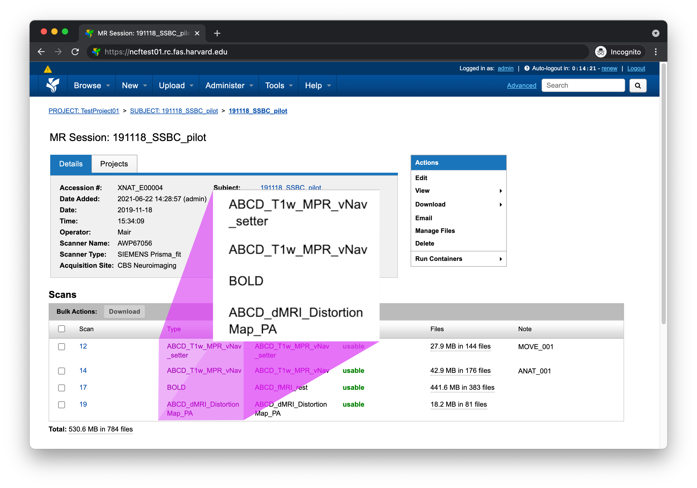

### Running the pipeline
To launch the BOLDQC pipeline from within XNAT, you should use the 
`Run Containers > boldqc-session` button located within the `Actions` box on 
the MR Session report page

!!! question "I don't see the `Run Containers` menu"
    If you don't see the Run Containers menu, please refer to 
    [Setting up the container][].

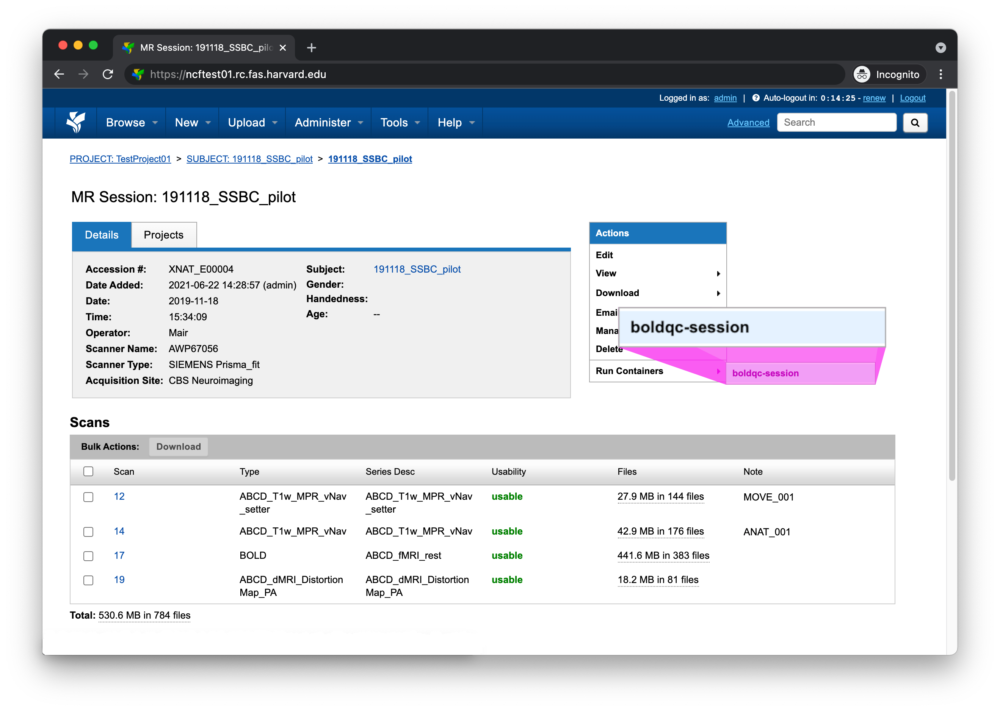

This should bring up a small dialog with several configurable options. You will 
find an overview of each setting under [Container launch settings][] below.

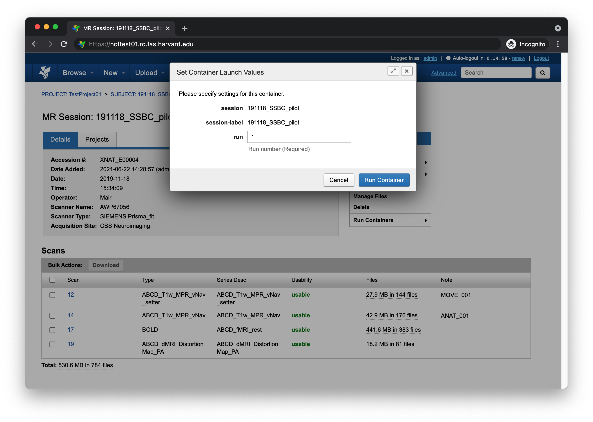

#### Container launch settings
##### run
This should be set to the integer value of the BOLD scan you wish to process

!!! note "Important note"
    The `run` number is *not* the scan number. If scan `17` was the first 
    BOLD scan within the MR session, the `run` number would be `1`, the 
    second BOLD scan would be run `2`, and so on.

| BOLD scan | run |
|-----------|-----|
| 1st BOLD  | 1   |
| 2nd BOLD  | 2   |
| 3rd BOLD  | 3   |

### Understanding the report page
The following section will break down each section of the BOLDQC report page.

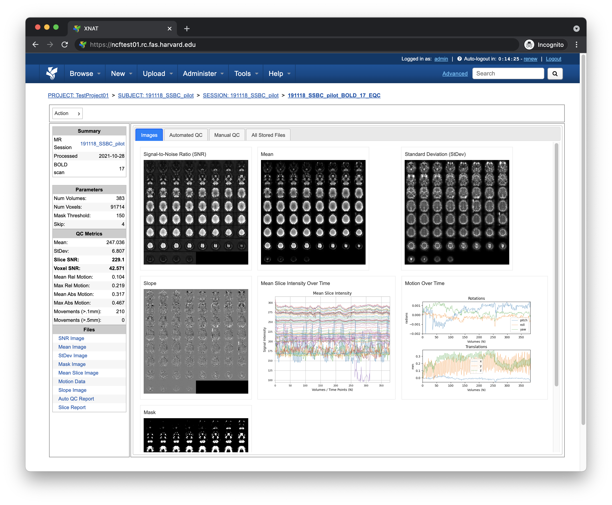

#### Left pane
The left pane is broken up into several sections. Each section will be described
below.

##### Summary
The `Summary` section orients the user to the MR Session they're currently 
looking at, in addition to various processing details

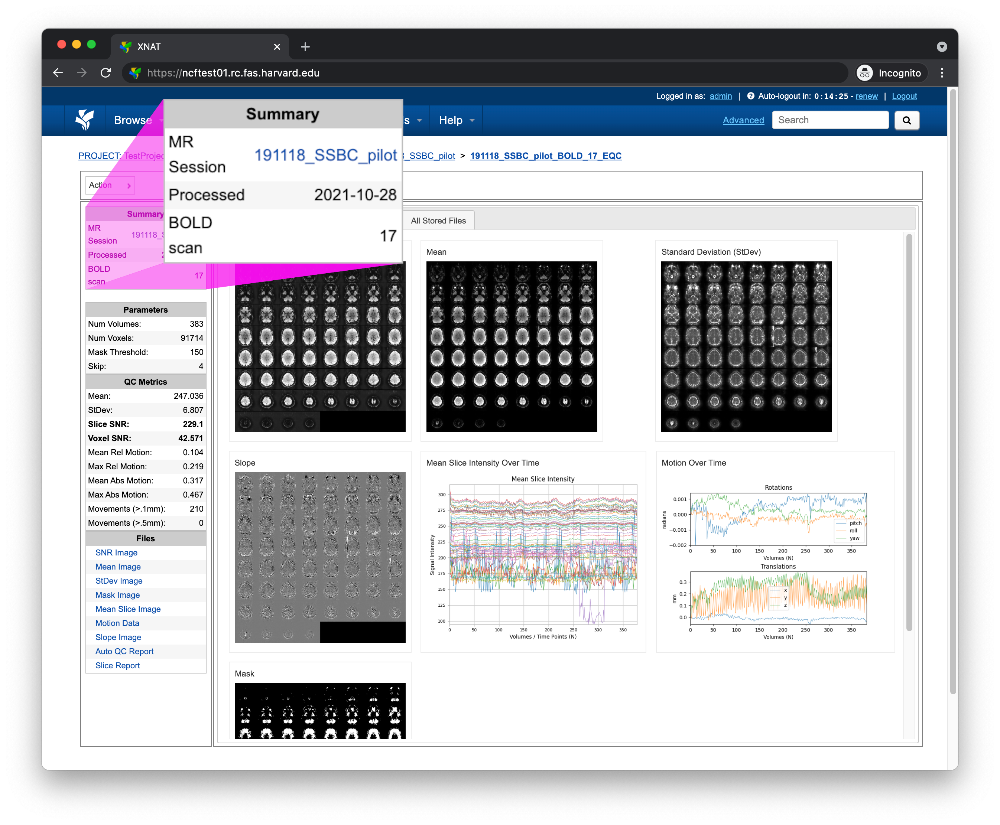

| Key        | Description       |
|------------|-------------------|
| MR Session | MR Session label  |
| Processed  | Processing date   |
| BOLD scan  | Processed BOLD scan |

##### Parameters
The `Parameters` section displays fine-grained scan information

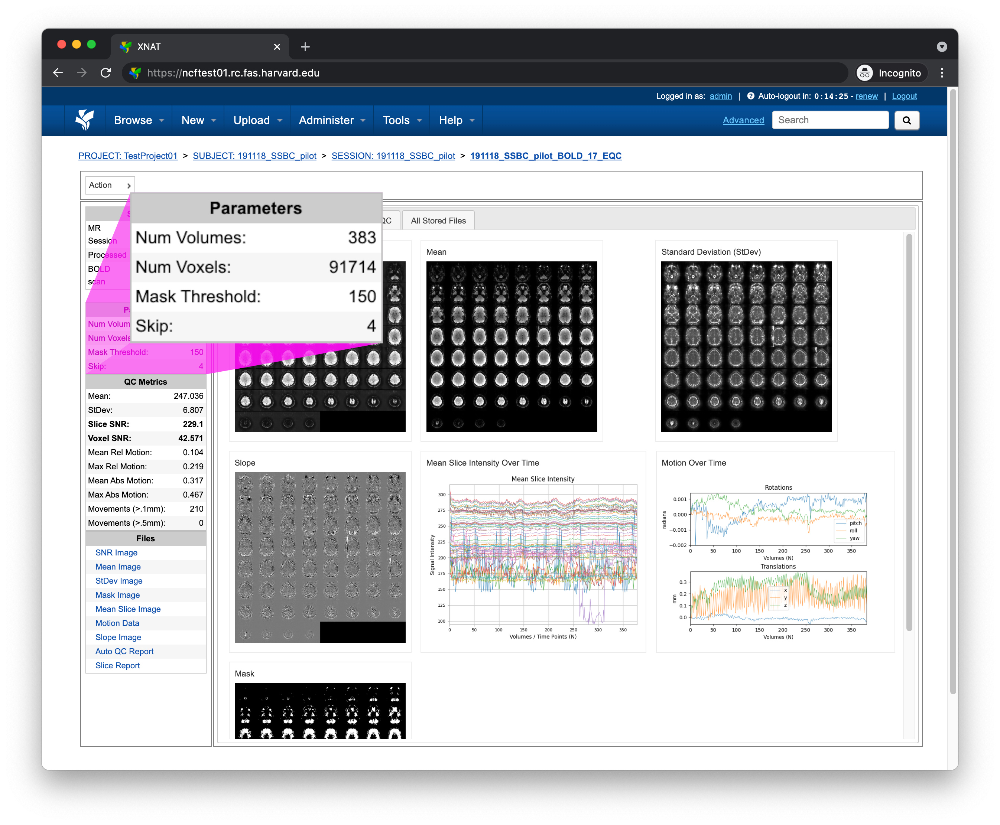

| Key            | Description                              |
|----------------|------------------------------------------|
| Num Volumes    | Number of time points                    |
| Num Voxels     | Number of voxels included in the analysis |
| Mask Threshold | Masking threshold                        |
| Skip           | Number of initial time points discarded  |

##### QC Metrics
The `QC Metrics` section displays quality control metrics computed 
*over the entire 4-D volume*

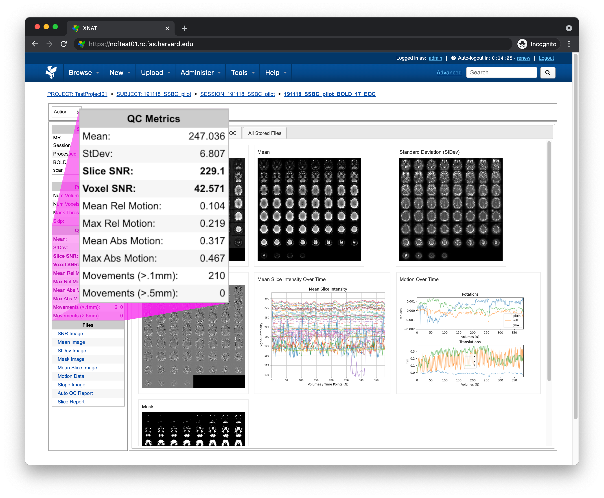

| Metric            | Description                                    |
|-------------------|------------------------------------------------|
| Mean              | Mean signal intensity                          |
| StDev             | Mean voxel standard deviation                  |
| Slice SNR         | Mean slice-based SNR (sensitive to motion)     |
| Voxel SNR         | Mean voxel SNR                                 |
| Mean Rel Motion   | Mean relative translations in 3D (mm)          |
| Max Rel Motion    | Maximum relative motion (mm)                   |
| Mean Abs Motion   | Mean absolute motion in 3D (mm)                |
| Max Abs Motion    | Maximum absolute motion (mm)                   |
| Movements (>.1mm) | Number of relative translations in 3D > .1mm  |
| Movements (>.5mm) | Number of relative translations in 3D > .5mm  |

##### Files
The `Files` section contains the most commonly requested files. Clicking on any 
of these files will display the file in the browser

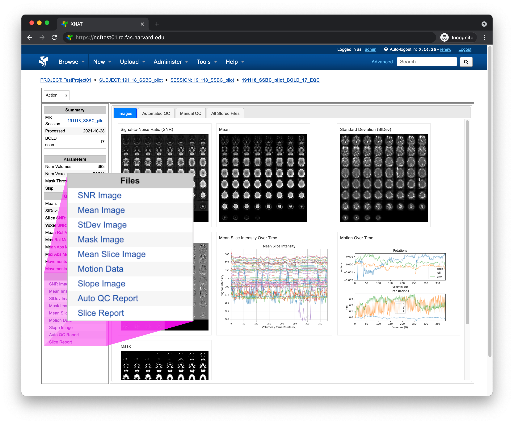

| File             | Description                                       |
|------------------|---------------------------------------------------|
| SNR Image        | BOLD signal SNR image, axial                      |
| Mean Image       | BOLD signal mean image, axial                     |
| StDev Image      | BOLD signal standard deviation image, axial       |
| Mask Image       | Masked image                                      |
| Mean Slice Image | BOLD signal mean slice intensity plot             |
| Motion Data      | Motion (translations and rotations) plot          |
| Slope Image      | BOLD signal slope image, axial                    |
| Auto QC Report   | Automated QC report                               |
| Slice Report     | Individual slice QC report                        |

#### Tabs
To the right of the left pane, you'll find a tabbed container. The following 
section explains the contents of each tab.

##### Images
The `Images` tab displays mosaic views of the SNR, Mean, Standard 
Deviation, Slope, and Mask images. In addition to these, there are 
traditional plots for Mean Slice Intensity and Motion.

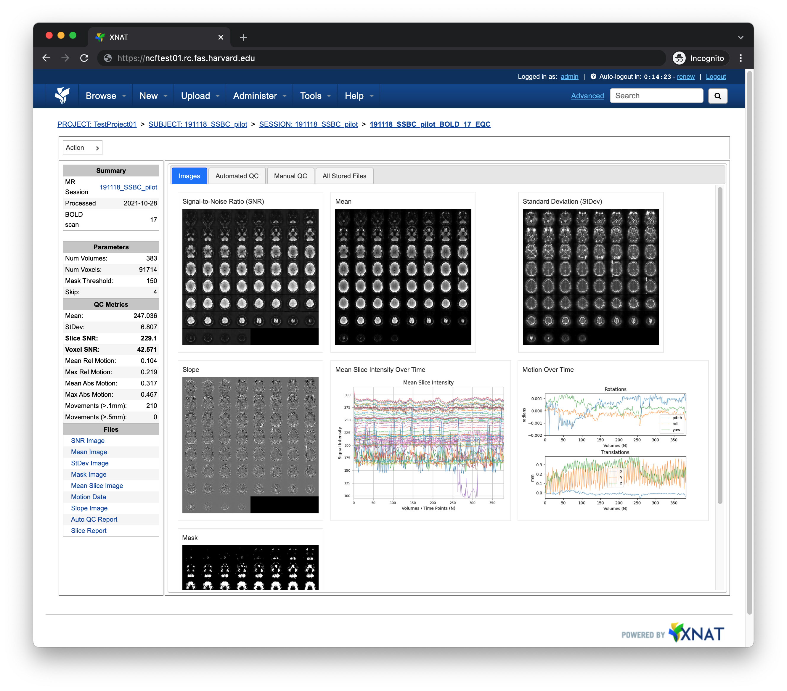

Clicking on any image within the `Images` tab should display a larger version of 
the image within the browser.

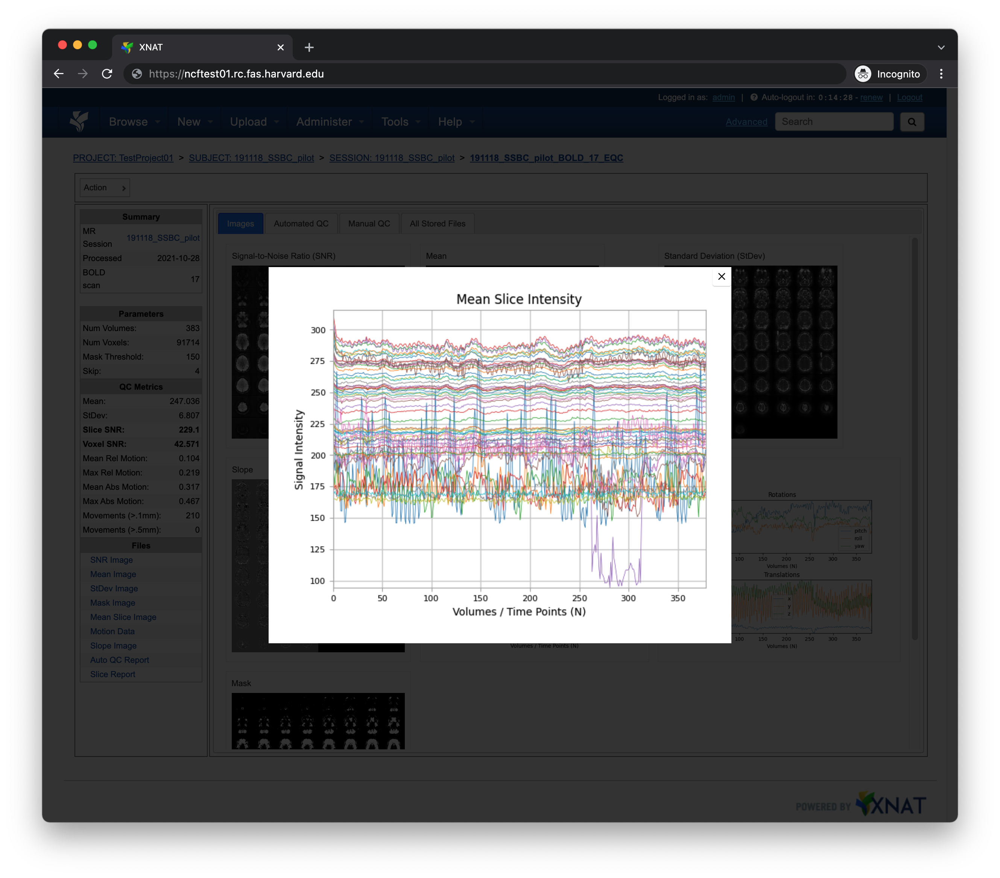

##### Automated QC
The `Automated QC` tab displays a complete list of BOLDQC quality control
metrics.

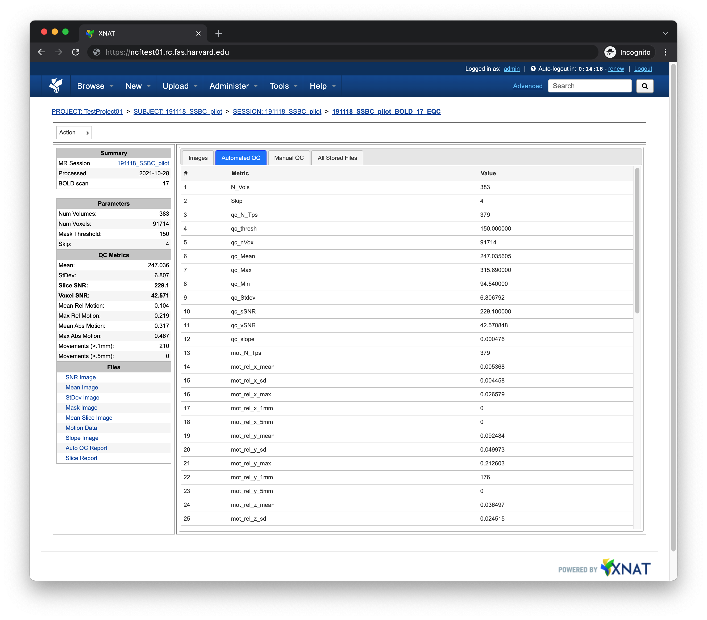

##### Manual QC
The `Manual QC` tab contains a form allowing a quality control 
technician to record additional observations, comments, and assign 
a final `PASS`, `WARN`, or `FAIL` grade to the scan

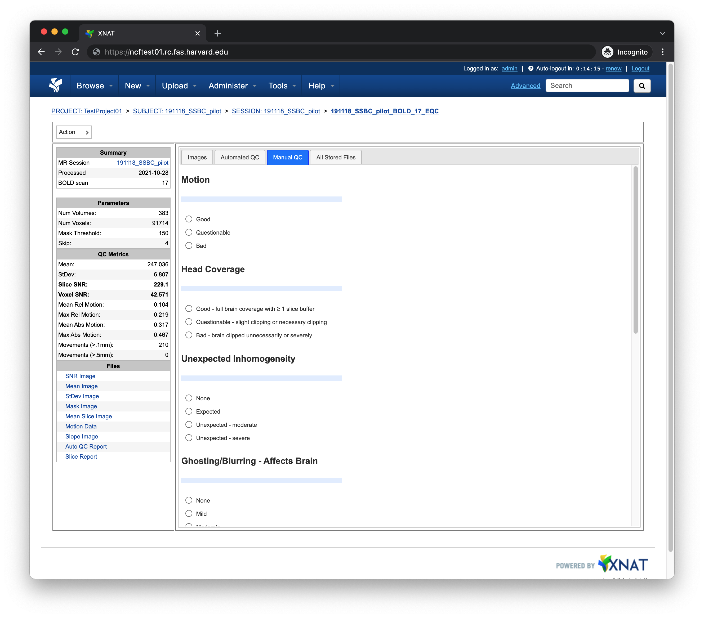

##### All Stored Files
The `All Stored Files` tab contains a list of every file stored by BOLDQC.
Clicking on any of these files will download the file

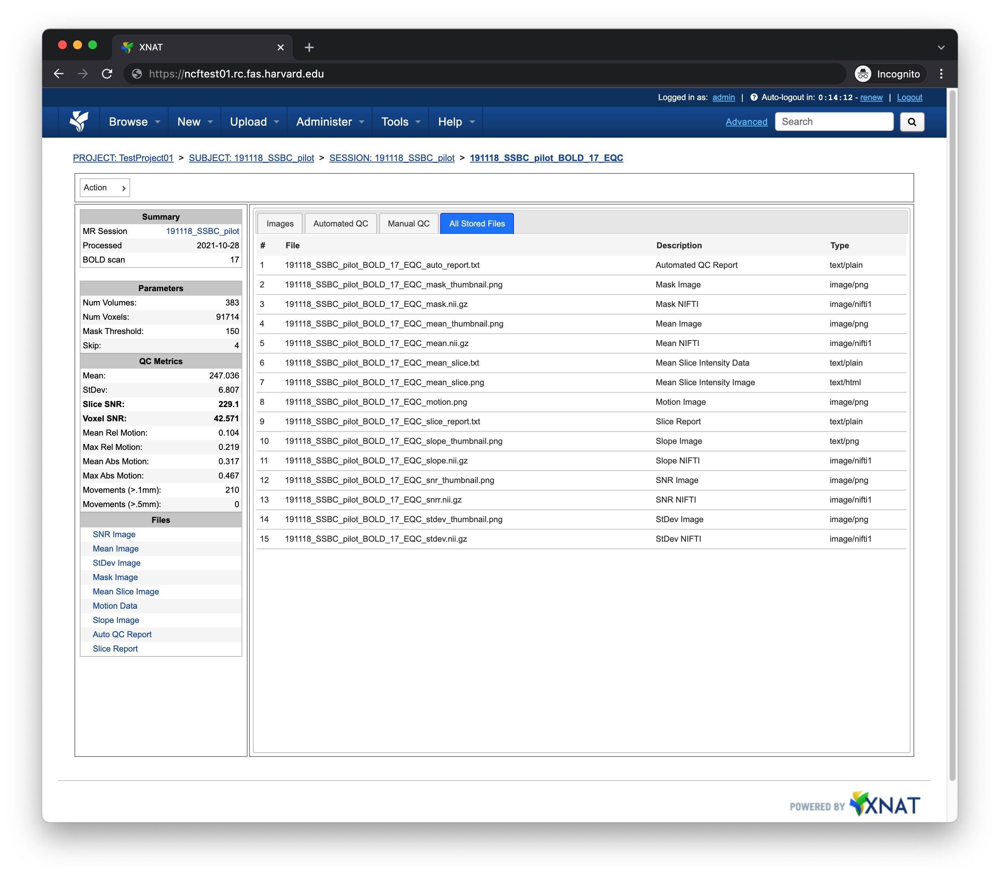

| File                          | Description                          |
|-------------------------------|--------------------------------------|
| `*_EQC_auto_report.txt`      | Automated QC report                  |
| `*_EQC_mask_thumbnail.png`   | Mask snapshot image                  |
| `*_EQC_mask.nii.gz`          | Mask NIFTI                           |
| `*_EQC_mean_thumbnail.png`   | Mean snapshot image                  |
| `*_EQC_mean.nii.gz`          | Mean NIFTI                           |
| `*_EQC_mean_slice.txt`       | Mean slice intensity data            |
| `*_EQC_mean_slice.png`       | Mean slice intensity plot            |
| `*_EQC_motion.png`           | Motion plot                          |
| `*_EQC_slice_report.txt`     | Slice report                         |
| `*_EQC_slope_thumbnail.png`  | Slope snapshot image                 |
| `*_EQC_slope.nii.gz`         | Slope NIFTI                          |
| `*_EQC_snr_thumbnail.png`    | SNR snapshot image                   |
| `*_EQC_snr.nii.gz`           | SNR NIFTI                            |
| `*_EQC_stdev_thumbnail.png`  | Standard deviation snapshot image    |
| `*_EQC_stdev.nii.gz`         | Standard deviation image             |


[BOLD]: https://tinyurl.com/dxs6zj2z
[XNAT]: https://doi.org/10.1385/NI:5:1:11
[Setting up the container]: ../admin/#setting-up-the-container
[Container launch settings]: #container-launch-settings
[BIDS]: https://bids-specification.readthedocs.io/en/stable/
[Apptainer]: https://apptainer.org/
[Container download]: ../admin/#downloading-the-container
[Tagging your scans]: #tagging-your-scans
[XNAT Scans API]: https://wiki.xnat.org/xnat-api/image-session-scans-api
[get]: #get
[process]: #process
[tandem]: #tandem
